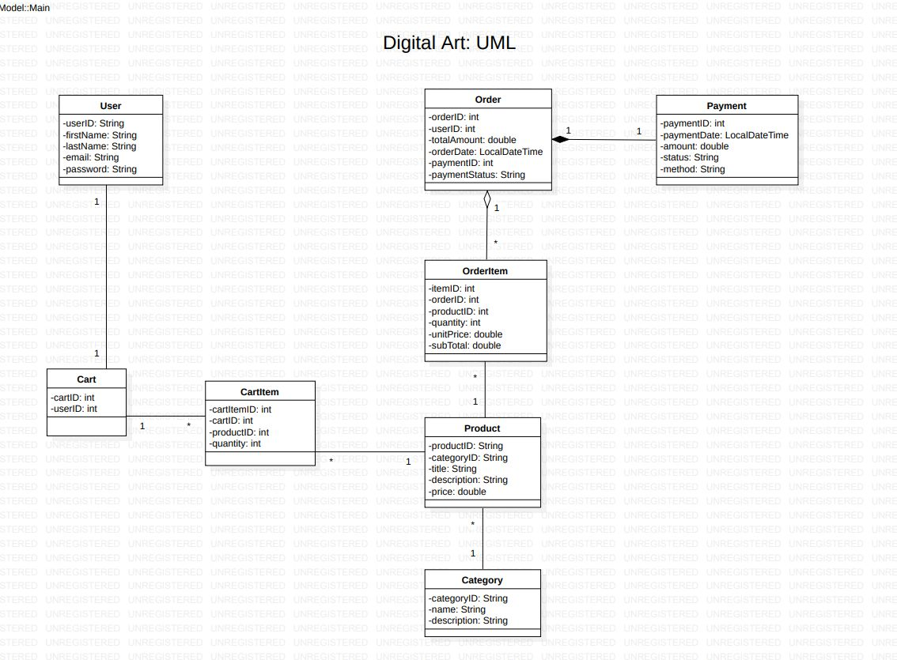

# ADP3 Capstone Project
## UML Class Diagram


## 🔗 Backend (Spring Boot API)

The frontend is powered by a REST API built with Spring Boot.

### 📁 Backend Repository
[ADP3 Backend (Spring Boot)](https://github.com/BekithembaMrwetyana/ADP3_Capstone_Project)

### ⚙️ API Setup
1. Clone the backend repository:
   ```bash
   git clone https://github.com/your-username/ADP3_Backend.git
   cd ADP3_Backend

